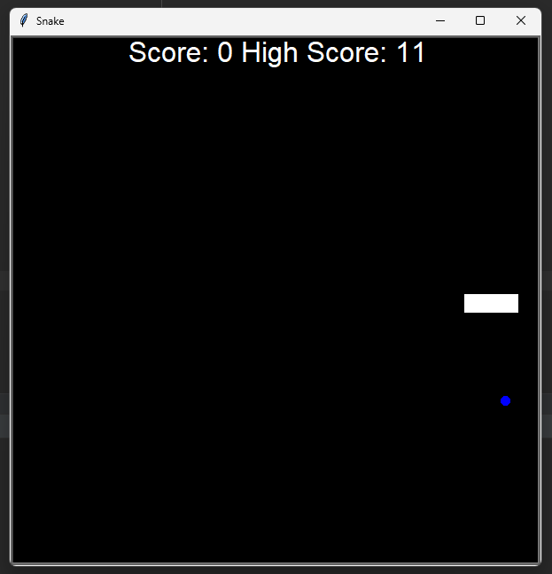

## Snake

For many years, players all across the world have cherished the iconic video game Snake. The player controls a snake that crawls around the screen while attempting to consume food, avoiding obstacles or running into its own tail. It is a straightforward but addictive game. The snake lengthens each time it consumes food, and the player must control it as it moves through the game’s environment while attempting to consume as much food as they can without colliding. As the snake lengthens, the game’s difficulty increases because it gets more difficult to move around the screen. The Snake game is renowned for its straightforward gameplay features, which make it simple to learn but challenging to master.



### Setup

1.Clone this repo
```commandline
git clone https://github.com/zmohamed1905/Snake.git
```


### The Rules:
```commandline
1. The player controls a snake that moves around the screen, trying to eat food while avoiding obstacles or running into its own tail.
2. The snake grows longer each time it eats food. 
3. The player loses if the snake runs into an obstacle or its own tail.
4. The player can control the direction the snake moves using arrow keys or a controller.
```

### Turtle Graphics:

- Turtle graphics is an implementation of the popular geometric drawing tools introduced in Logo, developed by Wally Feurzeig, Seymour Papert and Cynthia Solomon in 1967.
- In Python, turtle graphics provides a representation of a physical “turtle” (a little robot with a pen) that draws on a sheet of paper on the floor.
- The use of turtle graphics allowed for the production of the graphical output of the Snake in the game without having to use other more complex libraries to achieve the desired output.
